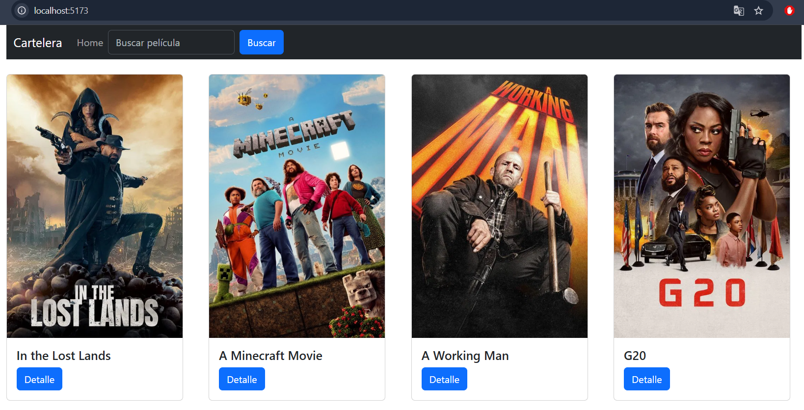
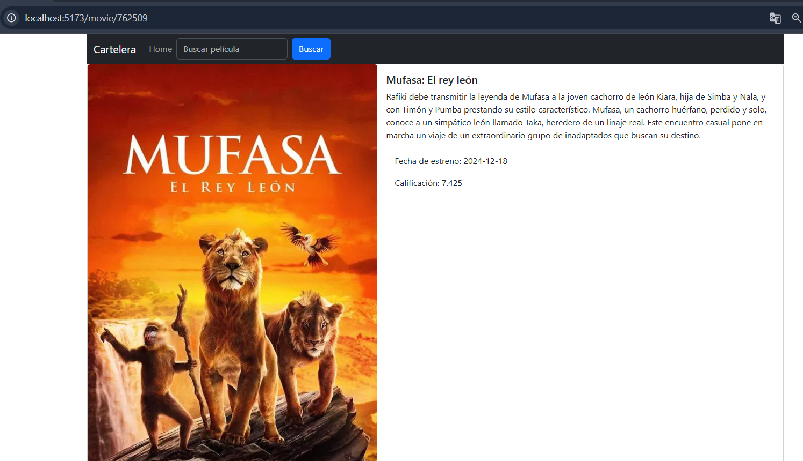
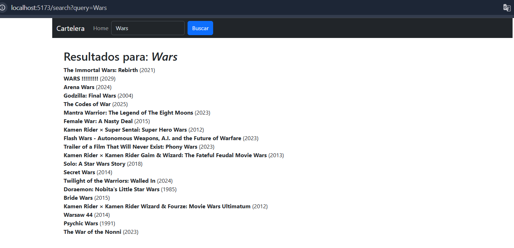

This is a [Next.js](https://nextjs.org) project bootstrapped with [`create-next-app`](https://github.com/vercel/next.js/tree/canary/packages/create-next-app).

## Getting Started

<h3>La ejecución de la app se hace por medio de:</h3>

```bash
npm run dev

> u5u6-react-ssr@0.1.0 dev
> next dev

   ▲ Next.js 15.3.1
   - Local:        http://localhost:3000
   - Network:      http://192.168.1.13:3000
   - Environments: .env.local

 ✓ Starting...
 ✓ Ready in 2.1s
 ○ Compiling /movie/[id] ...
```

Open [http://localhost:3000](http://localhost:3000) with your browser to see the result.

You can start editing the page by modifying `app/page.js`. The page auto-updates as you edit the file.

This project uses [`next/font`](https://nextjs.org/docs/app/building-your-application/optimizing/fonts) to automatically optimize and load [Geist](https://vercel.com/font), a new font family for Vercel.

Este proyecto de TuCine cuenta con tres apartados:


<h2>Home</h2>
</br> Se muestra una lista de las películas más populares en el momento.


</br>
<h2>Detail</h2>
</br> Se muestra más información de la película selccionada.


</br>
<h2>Search</h2>
</br> Como se puede ver en la cabecera de la web, es posible introducir un texto el cual nos presentará 
una lista de películas que coincidan con dicha cadena.

</br>


Se le ha de configurar un .env, se adjunta uno de ejemplo.
